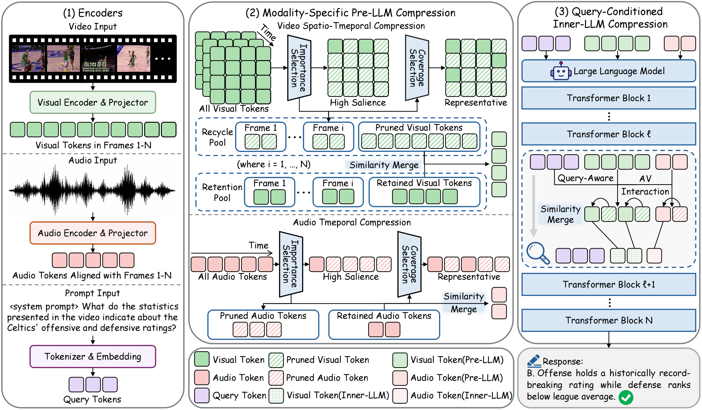

# OmniPack: Training-free token compression for efficient omni-modal LLM inference

This is the official implementation of our papar:
**"OmniPack: Training-free token compression for efficient omni-modal LLM inference"**

> <a href="https://github.com/RowanSu" target="_blank">Wanshun Su</a>, <a href="https://scholar.google.com/citations?hl=zh-CN&user=d_-6W4YAAAAJ" target="_blank">Yang Shi</a>, <a href="" target="_blank">Feihu Liu</a>, <a href="" target="_blank">Ziwen Yu</a>, <a href="https://scholar.google.com/citations?user=8bSWUAgAAAAJ" target="_blank">Yan Min</a>, <a href="https://dblp.org/pid/81/10181-3.html" target="_blank">Zhuoran Zhang</a>, <a href="https://scholar.google.com/citations?hl=en&user=a_dDoucAAAAJ" target="_blank">Qixun Wang</a>, <a href="https://scholar.google.com/citations?user=CbH1UJAAAAAJ" target="_blank">Haotian Wang</a>, <a href="https://scholar.google.com/citations?user=Ec6IbxsAAAAJ" target="_blank">Shixuan Liu</a>, <a href="https://scholar.google.com/citations?user=COdftTMAAAAJ" target="_blank">Yuanxing Zhang</a>, <a href="https://scholar.google.com.hk/citations?user=QkNqUH4AAAAJ" target="_blank">Peng Wu</a>, <a href="https://dblp.org/pid/81/8757.html" target="_blank">Chengfu Huo</a>, <a href="https://scholar.google.com/citations?user=lFCLvOAAAAAJ" target="_blank">Liang Ding</a>

[](https://arxiv.org/abs/2608.03812)



## News

- **[2026/09/27]** Released OmniPack code for **Qwen2.5-Omni**, with LMMs-Eval integration and baselines including [FastV, FastVid, VisionZip, VidCom2, OmniZip, ,OmniSIFT, SEATS, and their omni-modal variants](https://github.com/RowanSu/OmniPack#baselines).
- **[2026/08/04]** Paper released on [arXiv](https://arxiv.org/abs/2608.03812).

## Highlight

- We identify limitations of existing Omni-LLM compression under aggressive token budgets: inadequate long-range audio-visual structure modeling and insufficient exploitation of query-conditioned cross-modal evidence.

- We propose OmniPack, a training-free progressive framework that combines modality-specific pre-LLM compression with query-conditioned inner-LLM compression, while merging removed information into retained representatives.

- Experiments across multiple Omni-LLMs and benchmarks show that OmniPack preserves strong multimodal understanding while substantially reducing computation and accelerating inference.

## Code release

- [x] OmniPack core implementation for Qwen2.5-Omni.
- [x] Unified LMMs-Eval model wrapper and benchmark adaptations.
- [x] Evaluation scripts and configuration files.
- [x] Token-compression baseline implementations, include Full-token, Random, FastV, FastV-Omni, FastVID, VisionZip,
      VisionZip-Omni, VidCom2, OmniZip, OmniSIFT, and SEATS baselines.
- [ ] OmniPack support and code release for MiniCPM.

## Repository structure

```text
OmniPack/
├── omnipack/                         # OmniPack implementation and config
│   ├── __init__.py                   # Patch entry point
│   ├── pre_llm_units.py              # Pre-LLM compression
│   ├── inner_llm_units.py            # Inner-LLM compression
│   ├── modeling_qwen2_5_omni_omnipack.py
│   └── config.yaml
├── baselines/                        # Baseline implementations
│   ├── utils.py                      # Method dispatcher
│   ├── full_tokens/
│   ├── visionzip_omni/
│   ├── fastv_omni/
│   └── ...
├── models/qwen2_5_omni/              # Vendored Qwen2.5-Omni model code
├── lmms-eval/                        # Bundled LMMs-Eval adaptation
├── scripts/                          # Evaluation entry points
└── requirements.txt
```

## Installation

Python 3.10 is recommended.

```bash
cd /path/to/OmniPack

conda create -n omnipack python=3.10 -y
conda activate omnipack

bash scripts/base/setup.sh

cd lmms-eval
pip install -e .
cd ..

# Install a PyTorch build compatible with your CUDA environment first.
# FlashAttention is recommended by the evaluation launcher.
pip install flash-attn --no-build-isolation

# Alternatively, install all dependencies from requirements.txt:
pip install -r requirements.txt
```

### Runtime configuration

Review the launcher files before running an evaluation:

- Set `base_model_dir` in `scripts/base/eval_qwen2_5_omni_zip.sh` to the local Qwen2.5-Omni checkpoint directory.
- Configure Hugging Face access in your shell. Do not commit access tokens:

  ```bash
  export HF_HOME=/path/to/huggingface-cache
  export HF_TOKEN=<your-token>
  # Optional mirror:
  # export HF_ENDPOINT=https://hf-mirror.com
  ```

## Data preparation

Download each benchmark's annotations and media, then update the corresponding
task configuration under `lmms-eval/lmms_eval/tasks/` if your local paths
differ from the defaults.

| Benchmark   | Data                                                                           | Videos                                                                                 | Task name       |
| ----------- | ------------------------------------------------------------------------------ | -------------------------------------------------------------------------------------- | --------------- |
| AVUT        | [RowanSu/AVUTBenchmark](https://huggingface.co/datasets/RowanSu/AVUTBenchmark) | [tsinghua-ee/AVUTBenchmark](https://huggingface.co/datasets/tsinghua-ee/AVUTBenchmark) | `avutbenchmark` |
| WorldSense  | [lmms-lab/WorldSense](https://huggingface.co/datasets/lmms-lab/WorldSense)     | [lmms-lab/WorldSense](https://huggingface.co/datasets/lmms-lab/WorldSense)             | `worldsense`    |
| DailyOmni   | [RowanSu/Daily-Omni](https://huggingface.co/datasets/RowanSu/Daily-Omni)       | [liarliar/Daily-Omni](https://huggingface.co/datasets/liarliar/Daily-Omni)             | `dailyomni`     |
| VideoMME    | [lmms-lab/Video-MME](https://huggingface.co/datasets/lmms-lab/Video-MME)       | [lmms-lab/Video-MME](https://huggingface.co/datasets/lmms-lab/Video-MME)               | `videomme`      |
| LVOmniBench | [RowanSu/LVOmniBench](https://huggingface.co/datasets/RowanSu/LVOmniBench)     | [KD-TAO/LVOmniBench](https://huggingface.co/datasets/KD-TAO/LVOmniBench)               | `lvomnibench`   |

## Evaluation

Each method-specific script defines two editable arrays:

- `tasks_list`: LMMs-Eval task names.
- `ratio_pairs`: `video_ratio audio_ratio` retention pairs.

The scripts pass these values to the shared launcher in
`scripts/base/eval_qwen2_5_omni_zip.sh`.

### OmniPack

```bash
bash scripts/eval_qwen2_5_omni_omnipack.sh
```

Edit the following files to change the evaluation:

- `scripts/eval_qwen2_5_omni_omnipack.sh`: tasks and retention ratios.
- `omnipack/config.yaml`: encoder scaling, window sizes, and the Stage-II
  pruning layer.

### Other baselines

```bash
bash scripts/eval_qwen2_5_omni_full_tokens.sh
bash scripts/eval_qwen2_5_omni_random.sh
bash scripts/eval_qwen2_5_omni_fastv.sh
bash scripts/eval_qwen2_5_omni_fastv_omni.sh
bash scripts/eval_qwen2_5_omni_fastvid.sh
bash scripts/eval_qwen2_5_omni_visionzip.sh
bash scripts/eval_qwen2_5_omni_visionzip_omni.sh
bash scripts/eval_qwen2_5_omni_dycoke.sh
bash scripts/eval_qwen2_5_omni_holitom.sh
bash scripts/eval_qwen2_5_omni_omnizip.sh
bash scripts/eval_qwen2_5_omni_omnisift.sh
bash scripts/eval_qwen2_5_omni_vidcom2.sh
```

## Acknowledgements

This repository builds on
[Qwen2.5-Omni](https://github.com/QwenLM/Qwen2.5-Omni),
[LMMs-Eval](https://github.com/EvolvingLMMs-Lab/lmms-eval),
[OmniZip](https://github.com/KD-TAO/OmniZip), and
[SEATS](https://github.com/xxayt/SEATS).

## Contact

If you have any questions, please feel free to contact me at suws0616@gmail.com

## Citation

If you find this work useful, please consider citing:

```bibtex
@article{su2026omnipack,
  title={OmniPack: Unified Token Compression for Efficient Omni-modal Large Language Models},
  author={Su, Wanshun and Shi, Yang and Liu, Feihu and Yu, Ziwen and Min, Yan and Zhang, Zhuoran and Wang, Qixun and Wang, Haotian and Liu, Shixuan and Zhang, Yuanxing and others},
  journal={arXiv preprint arXiv:2608.03812},
  year={2026}
}
```
